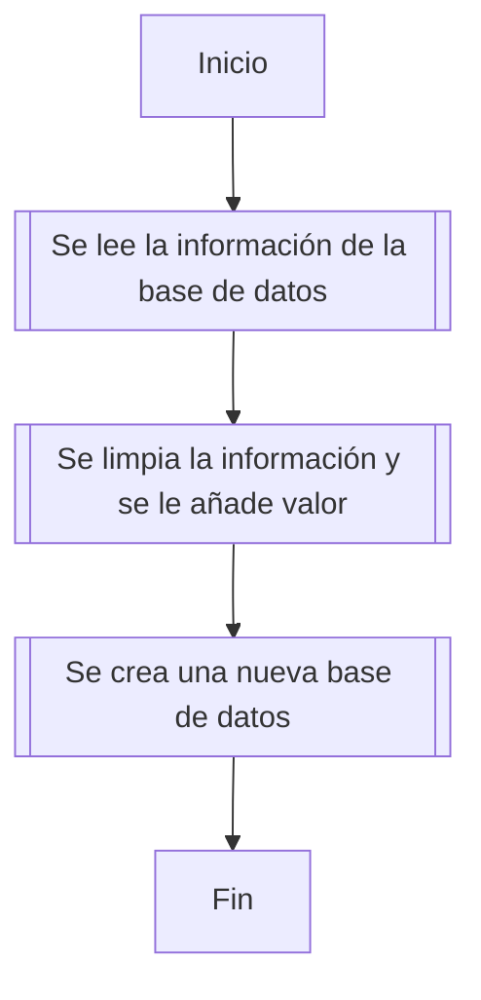

# Practica del proceso ETL

> 12/07/2022

En este proceso se realizó lo siguiente:

1. Extracción de la información de una base de datos local
2. Transformación de la información, en donde se limpio el data set generado en la extracción y se enriquesio el data set
3. Se cargo la infomación en un archivo de base de datos en sqlite

## ¿Cómo ejecutar el proyecto?

1. Abrir el espacio de trabajo MySQLWorkbench y ejecutar el archivo `script.sql`.
2. Verificar que el archivo `main.py` de la carpeta extract, tenga la configuración adecuada para acceder a la base de datos.
3. Abrir la consola de **_Anaconda_** para ejecutar el comando `python main.py`